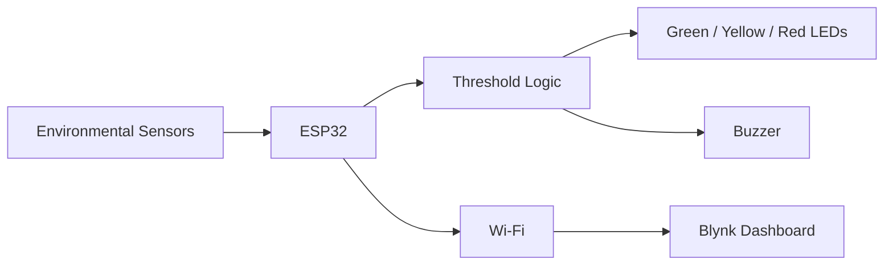

# IoT Air Quality Monitoring System

<p align="center">
  <strong>ESP32 environmental monitoring with gas sensing, dust detection, alerts, and Blynk telemetry</strong>
</p>

<p align="center">
  
  
  
</p>

## Project at a Glance

| Item | Details |
|---|---|
| Domain | Environmental monitoring |
| Controller | ESP32 |
| Sensors | DHT22, MQ135, MQ7, MQ2, GP2Y1014AU |
| Outputs | LEDs, buzzer, cloud telemetry |
| Dashboard | Blynk |
| Status | Academic embedded prototype |

## Overview

This project monitors temperature, humidity, gas-sensor readings, and airborne dust. The ESP32 applies simple local alert logic and sends measurements to Blynk for remote monitoring.

## Prototype Result

<p align="center">
  
</p>

## System Flow



## Features

- Temperature and humidity monitoring
- MQ-series gas sensing
- Optical dust sensing
- Three-level local status indication
- Audible alarm for unsafe conditions
- ESP32 Wi-Fi connectivity
- Blynk dashboard integration

## Repository Structure

```text
Air-Quality/
├── code/
├── component/
└── result/
```

## Run

Open `code/CODE/CODE.ino` in Arduino IDE, install the required ESP32, Blynk, and DHT libraries, configure your local credentials, select the correct board, and upload.

## Security

The public firmware uses credential placeholders. Keep real Wi-Fi passwords and Blynk tokens outside source control.

## Future Work

- Sensor calibration and ppm conversion
- Historical data logging
- Alert history
- MQTT support
- Offline fallback
- Better enclosure and airflow design

## Author

**Sadik Shaik**

Computer Engineering · Embedded Systems · Environmental IoT
